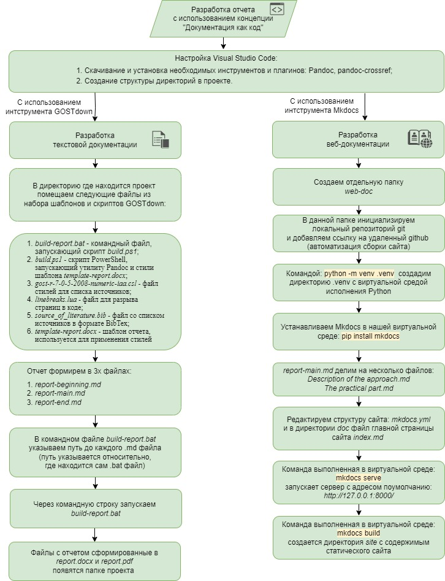
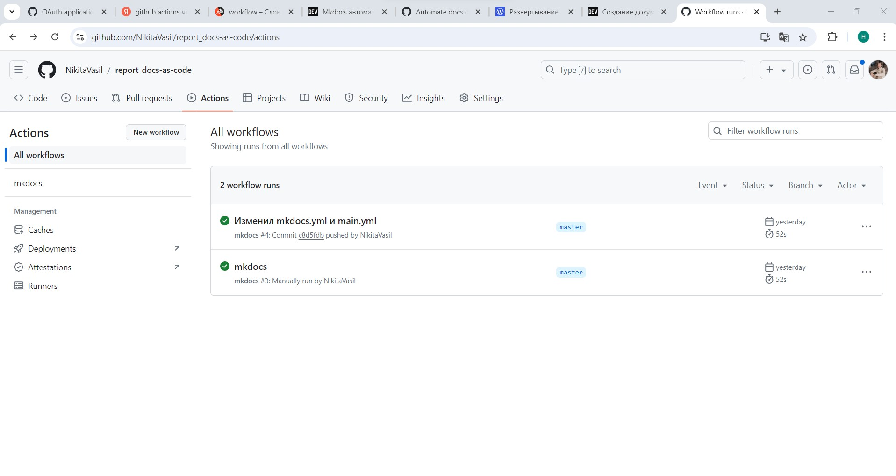
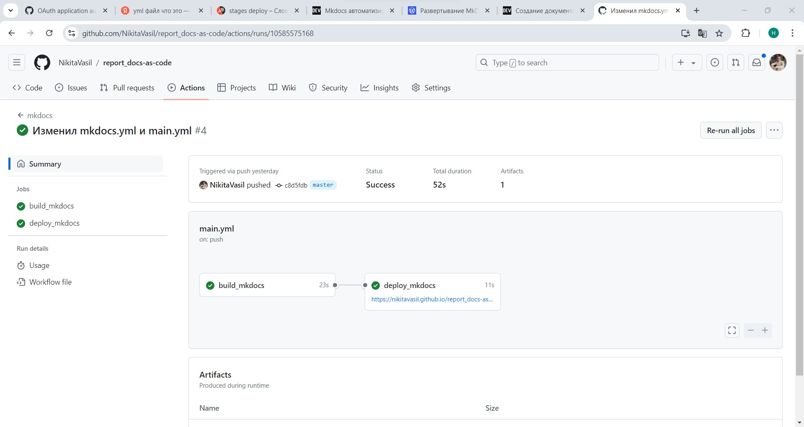

# Практическая часть

В целях получения практических навыков, реализуем отчет с использованием инструментов, которые применяются в подходе «Документация как Код» и проанализируем эффективность данной концепции.

При формировании отчета мною были выбраны следующие инструменты:

1. Распределенная система контроля версий `Git` с использованием многофункциональной платформы `GitHub` в роли удаленного репозитория.
2. Редактор кода `Visual Studio Code` - для создания струтуры проекта и работы с файлами, как показано на рисунке.
3. Язык разметки `Markdown` - для написание отчета.
4. `Pandoc` и плагин к нему `pandoc-crossref` - это универсальная утилита для работы с текстовыми форматами, например преобразует `.docx` в `markdown` и наоборот.
5. GOSTdown - набор шаблонов и скриптов, позволяющий пользователям работать над содержательной частью документа в формате `Markdown`, получая на выходе автоматически собранный документ в формате `.docx`, не требующий ручной доработки. GOSTdown основан на универсальном конвертере документов Pandoc и скриптовом языке Powershell.
6. `Mkdocs` - это бесплатный статический генератор сайтов, предназначенный для создания проектной документации. Пример созданного статического сайта представлен на рисунке.
7. `Python` - для использования mkdocs (который написан на Python) и вспомогательные скрипты.

Порядок действий при создании текстовой докуменатции:

1. Создаем структуру проекта (отчета), как показано на рисунке;

    

2. Водную, основную и заключительную части текстового документа формата `Markdown` делим на три файла для удобства редактирования;
3. В директорию где находится проект помещаем следующие файлы из набора шаблонов и скриптов GOSTdown:
    - `build-report.bat` - это командный файл, который запускает `build.ps1` с аргументами, а также содержит список `Markdown` файлов в том порядке, котором должен отображаться итоговый `.docx` файл;
    - `build.ps1` - основной скрипт PowerShell, запускающий утилиту `Pandoc` для преобразования и применяющий стили из шаблона `template-report.docx`;
    - `gost-r-7-0-5-2008-numeric-iaa.csl` - это файл стилей для списка источников;
    - `linebreaks.lua` - обязательный файл для разрывов в коде;
    - `sources_of_literature.bib` - это список источников в формате BibTex;
    - `template-report.docx` - файл-шаблон.Скрипт использует этот файл, чтобы к тексту применять стили.
4. После того как отчет составлен в формате `Markdown` переводим его в формат `.docx`:
  
     - открываем командную строку и запускаем командный файл;
     - файлы под названием `report.docx` и `report.pdf` появятся в соответствующей папке.

При создании веб-документации используется следующий порядок действий:

1. Используем виртуальную среду. Виртуальная среда для Python позволит нам устанавливать все нужные пакеты в отдельную папку `.venv`:
    - создаем папку web-doc;
    - в создавшейся папке откроем команндрую строку и выполним следующую команду: `python -m venv .venv`. В папке будет создана директория `.venv` со средой исполнения Python;
    - чтобы выполнять команды в этой среде нужно её активировать. Выполним следующу команду: `.\.venv\Scripts\activate`.
2. Установим `Mkdocs`, выполнив команду в нашей виртуальной среде: `pip install mkdocs`;
3. Создается директория docs, где по умолчанию располагается файл index.md, его содержимое будет отображаться на главной странице сайта         (отредактируем данный файл и добавим два раздела с основной части отчета);
4. Внутри директории проекта будет создан файл `mkdocs.yml` для настройки структуры сайта, отредактируем его следующим образом:

``` yaml

      site_name: Отчет по практике
      site_description: Практическая работа с применением инструментов концепции "Документация как Код".
      site_author: Vasilnyak Nikita
      repo_url: https://github.com/NikitaVasil/report_docs-as-code

      theme:
      name: material

      nav:
        - Документация как Код:
        - Описание подхода: '.\Description of the approach.md'
        - Практическая часть: '.\The practical part.md'

      markdown_extensions:
        - abbr
        - attr_list
        - md_in_html
        - admonition
        - footnotes

      copyright: Copyright &copy; 2024 <a href="https://t.me/nikita_vasilnyak">Nikita Vasilnyak</a>.

```

__Сборка веб-документации__

1. Командой `mkdocs serve` - запускается сервер для отображения сайта, адрес поумолчанию `http://127.0.0.1:8000/`, как показано на рисунке ниже;

    

2. Командой `mkdocs build` - создается директория site c содержимым статического сайта.

__Порядок действий при разработке технической документации с использованием подхода «Документация как Код»__



## Автоматизация процесса сборки веб-документации с помощью GitHub Actions

GitHub Actions - это платформа непрерывной интеграции и непрерывной поставки (CI/CD), которая позволяет автоматизировать конвейер сборки, тестирования и развертывания. С помощью Github Actions можно выполнять следующие действия:

- запускать проверку кода линтером и тестами;
- выполнять деплой проекта;
- публиковать новую версию пакета;
- подключать оповещения в мессенджер о событиях в репозитории (новые issue, PR) и многое другое.

Общий принцип работы Github Actions заключается в создании в репозитории директории .github/workflows, в которой размещаются файлы с описанием шагов, необходимых для выполнения различных действий.

Последовательность действий автоматизации процесса сборки веб-документации:

1. Создаем в удаленном репозитории проекта в Actions(действие) новый Workflow(рабочий процесс), как показано на рисунке;
   
2. При создании рабочего процесса можно выбрать шаблон, либо создать свою конфигурацию в формате `yaml`, как показано ниже и сохраняем:

``` yml
    name: mkdocs

    on:
      push:
        branches:
          - master
        paths:
          - "web-source/**"
      workflow_dispatch:
    permissions:
      contents: write
      pages: write
      id-token: write

    jobs:
      build_mkdocs:
        runs-on: ubuntu-latest

        steps:
          - name: Checkout code
            uses: actions/checkout@v4
            with:
              fetch-depth: 0
          - uses: actions/setup-python@v5
            with:
              python-version: 3.12.1
          - run: pip install \
              mkdocs-material
          - run: mkdocs gh-deploy --config-file web-source/web-doc/mkdocs.yml --force

      deploy_mkdocs:
        needs: build_mkdocs
        environment:
          name: github-pages
          url: ${{ steps.deployment.outputs.page_url }}
        runs-on: ubuntu-latest
        steps:
          - name: Checkout
            uses: actions/checkout@v4
            with:
              ref: gh-pages
          - name: Setup Pages
            uses: actions/configure-pages@v5
          - name: Upload artifact
            uses: actions/upload-pages-artifact@v3
            with:
              path: "."
          - name: Deploy to GitHub Pages
            id: deployment
            uses: actions/deploy-pages@v4
```

Для выполнения определенных действий рабочему процессу необходимо предоставить разрешения, такие как `contents, pages, id-token`.

В своем рабочем процессе я буду использовать две задачи:

- Этапы (build_mkdocs) сборки веб-документации:
    1. Проверяет главную ветку;
    2. Устанавливает(настраивает) `Python`;
    3. Устанавливает `mkdocs` и плагин(тему) к нему `mkdocs_material`;
    4. Запускает `mkdocs gh-deploy` - сайт развернется в ветку по умолчанию `gh-pages`.
- Этапы (deploy_mkdocs) развертывания веб-документации:
    1. Проверяет код из `gh-pages` ветки.
    2. Настраивает страницы GitHub.
    3. Загружает артефакты.
    4. Развертывает загруженные артефакты на GitHub Pages с помощью действия «actions/deploy-pages».

Данный рабочий процесс будет выполняться автоматически в том случае, если мы вносим изменения командой `git push origin <name_branch>` на удаленный репозиторий в папке `web-source/`. Успешное выполнение автоматического рабочего процесса с сформированной ссылкой на развернутый сайт показано на рисунке ниже.



Ссылка на развернутый сайт: [Сайт отчета по практике](https://nikitavasil.github.io/report_docs-as-code/)
Ссылка на github репозиторий: [Удаленный репозиторий](https://github.com/NikitaVasil/report_docs-as-code)

## Вывод о проделанной работе

При прохождении практики приобрел следующие навыки:

1. Научился применять инструмент `GOSTdown` при разработке технической документации. Предварительно настроил исполняемый `.bat` файл и текстовый шаблон в формате `.docx`. На выходе получил документ оформленный в соответствии с ГОСТ, но с небольшой корректировкой финального файла в WYSIWYG редакторе.

2. Познакомился с инструментом `Mkdocs` при генерации статического сайта. Рассмотрели автоматизацию процесса генерации статического сайта при помощи Actions (действий) GitHub. На выходе получил качественную веб-документацию, которую можно использовать, как Инструкцию для внешних пользователей или внутреннюю документацию (База знаний).

При разработке отчета с применением подхода "Документация как Код" для себя выделил следующие достоинства:

> автоматизация процесса документирования;
> применение тех же инструментов, что и при разработке ПО;
> удобное отслеживание изменений в версиях документов;
> улучшения качества документации (автоматические проверки, такие как линтеры и тесты, могут быть применены к документации так же, как и к коду);
> снижает затраты на поддержку и обновление документации (уменьшает риск возникновения устаревшей или некорректной документации);
> задел на будущее для разработки внутреннего портала документации.

К существенным недостаткам можно отнести _повышенный порог технических навыков_ для специалистов, которые занимаются разработкой документации и используют WYSIWYG редакторы при разарботке технических документов, что на данный момент может показаться удобнее и интуитивно понятнее. Поэтому необходимо понимать, что данный подход имеет место быть среди тех специалистов, у которых имеется определенный уровень подготовки.

Разработанная документация в формате `Markdown`, заслуженно пользуется популярностью в документации современного ПО, в веб-программировании и в электронных изданиях, а с недавнего времени еще и используется для создания полноценных документов, соответствующих требованиям российских государственных организаций. Текстовая основа формата позволяет использовать богатые возможности систем контроля версий.
Таким образом эффективность применения подхода "Документация как Код" при разработке технической документации обусловлена вышеупомянутыми достоинствами с минимальным недостатком, который решается получением навыков при прохождении учебных курсов.
