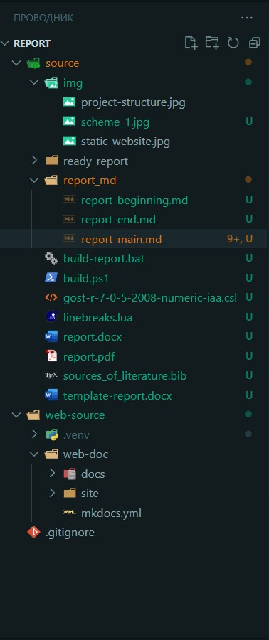

**<center>Практическая часть</center>**

Для полного понимания эффективности подхода "Документация как Код" при создании технической документации, разработаем отчет с использованием инструментов применяемых в данном подходе.

При формировании отчета мною были выбраны следующие инструменты:

1. Редактор кода `Visual Studio Code` - для создания струтуры проекта и работы с файлами.
2. Язык разметки `Markdown` - для написание отчета.
3. `Pandoc` и плагин к нему `pandoc-crossref` - это универсальная утилита для работы с текстовыми форматами, например преобразует `.docx` в `markdown` и наоборот.
4. GOSTdown - набор шаблонов и скриптов для автоматической вёрстки отчета в форматы `.docx` и `.pdf`.
5. `Mkdocs` - генератор статических сайтов, предназначенный для создания проектной документации.
6. `Python` - для использования mkdocs (который написан на Python).

Порядок действий при создании текстовой докуменатции:

- создаем структуру проекта (отчета), как показано на рисунке;
  
- вводную, основную и заключительную части текстового документа формата `Markdown` делим на три файла для удобства редактирования;
- в директорию где находится проект помещаем следующие файлы из набора шаблонов и скриптов GOSTdown:
    - `build-report.bat` - это командный файл, который запускает `build.ps1` с аргументами, а также содержит список `Markdown` файлов в том порядке, котором должен отображаться итоговый `.docx` файл;
    - `build.ps1` - основной скрипт PowerShell, запускающий утилиту `Pandoc` для преобразования и применяющий стили из шаблона `template-report.docx`;
    - `gost-r-7-0-5-2008-numeric-iaa.csl` - это файл стилей для списка источников;
    - `linebreaks.lua` - обязательный файл для разрывов в коде;
    - `sources_of_literature.bib` - это список источников в формате BibTex;
    - `template-report.docx` - файл-шаблон.Скрипт использует этот файл, чтобы к тексту применять стили.
- после того как отчет составлен в формате `Markdown` переводим его в формат `.docx`:
  - открываем командную строку и запускаем командный файл;
  - файлы под названием `report.docx` и `report.pdf` появятся в соответствующей папке.
  
При создании веб-документации используется следующий порядок действий:

- используем виртуальную среду. Виртуальная среда для Python позволит нам устанавливать все нужные пакеты в отдельную папку `.venv`:
    - создаем папку web-doc;
    - в создавшейся папке откроем команндрую строку и выполним следующую команду: `python -m venv .venv`. В папке будет создана директория `.venv` со средой исполнения Python;
    - чтобы выполнять команды в этой среде нужно её активировать. Выполним следующу команду: `.\.venv\Scripts\activate`.
- установим `Mkdocs`, выполнив команду в нашей виртуальной среде: `pip install mkdocs`;
- внутри директории проекта будет создан файл mkdocs.yml для настройки структуры сайта, отредактируем его следующим образом:
  
  ``` json

    site_name: Отчет по практической работе
      
    nav:
      - Документация как Код:
        - Описание подхода: '.\Description of the approach.md'
        - Практическая часть: '.\The practical part.md'
  
    markdown_extensions:
      - abbr
      - attr_list
      - md_in_html
      - admonition
      - footnotes
  
  ```

- также создается директория docs, где по умолчанию располагается файл index.md, его содержимое будет отображаться на главной странице сайта (отредактируем данный файл и добавим два раздела с основной части отчета);
- прописав команду: `mkdocs serve` - запускается сервер для отображения сайта, адрес поумолчанию `http://127.0.0.1:8000/`, как показано на рисунке ниже;


- прописав команду: `mkdocs build` - создается директория site c содержимым статического сайта.
